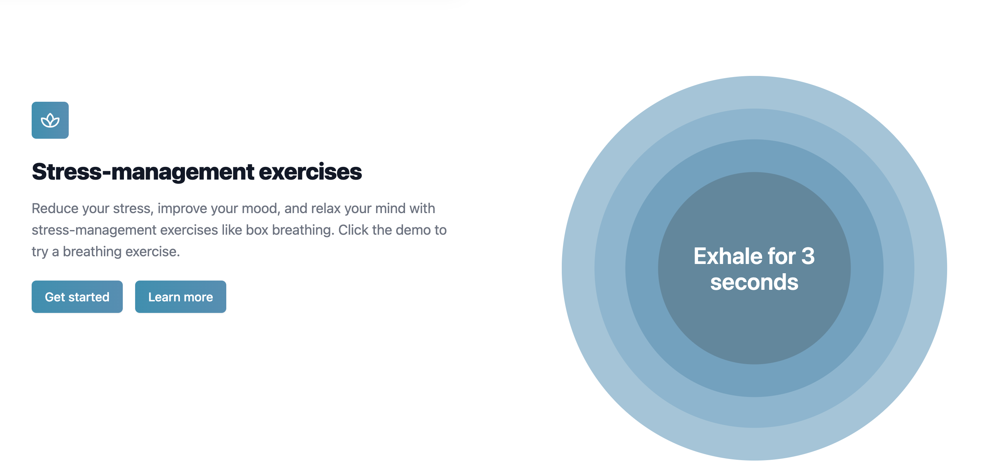

# **Mind Sanctuary**

I created a mental health app with a Mood Journal that tracks your moods on a Calendar, depression & personality tests, and guided breathing exercises that have been proven to improve mood. You can try it out and sign up for a free account at [mindsanctuary.net](https://mindsanctuary.net).

## Technologies Used
- React
- NextJS
- TailwindCSS
- Prisma ORM
- Postgresql
- Redux for state management.
- Next-auth for authentication

## Features
### Authentication
- OAuth and email/pass Authentication using Next-Auth
- Built-in email verification system using Nodemailer

### Mood Tracking

### Psychometrics

### Breathing Exercises
